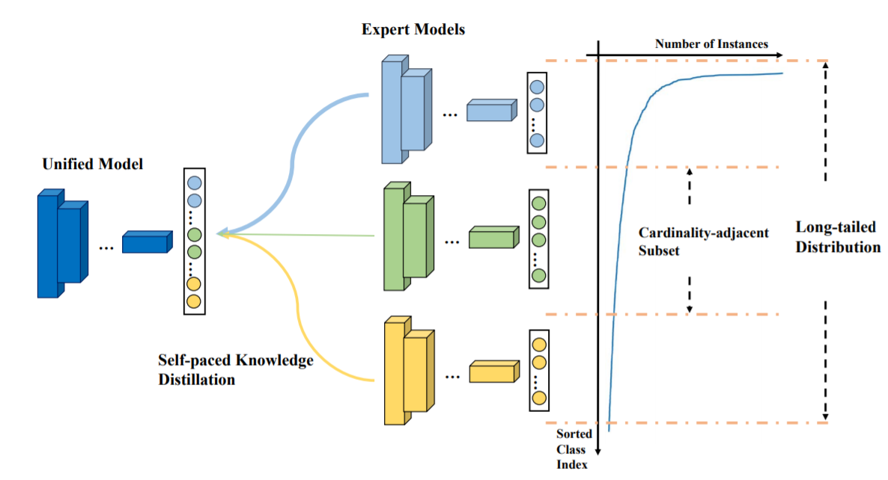

# Learning From Multiple Experts: Self-paced Knowledge Distillation for Long-tailed Classification

Implementation of   
"[Learning From Multiple Experts: Self-paced Knowledge Distillation for Long-tailed Classification](https://www.ecva.net/papers/eccv_2020/papers_ECCV/html/3119_ECCV_2020_paper.php)"   
Liuyu Xiang, Guiguang Ding, Jungong Han;

in European Conference on Computer Vision (ECCV), 2020, **Spotlight**




## Requirements

* [PyTorch](https://pytorch.org/) (version >= 0.4.1)
* [scikit-learn](https://scikit-learn.org/stable/)
Check requirements.txt for detailed instructions.

## Data Preparation

Follow [OLTR](https://github.com/zhmiao/OpenLongTailRecognition-OLTR) for data preparation.


## Getting Started (Training & Testing)

- Step 1: Train Expert models, or use the pre-trained model in ./logs/ImageNet_LT/
```
CUDA_VISIBLE_DEVICES=0 python main.py --config=./config/many_shot.py
CUDA_VISIBLE_DEVICES=0 python main.py --config=./config/median_shot.py
CUDA_VISIBLE_DEVICES=0 python main.py --config=./config/low_shot.py
```

- Step 2: Train a single model using the LFME
```
CUDA_VISIBLE_DEVICES=0 python main_LFME.py --config=./config/ImageNet_LT/LFME.py
```

- Evaluate LFME:
```
CUDA_VISIBLE_DEVICES=0 python main_LFME.py --config=./config/ImageNet_LT/LFME.py --test
```

## Citation

If you find our work useful for your research, please consider citing the following paper:
```
@inproceedings{xiang2020learning,
  title={Learning from multiple experts: Self-paced knowledge distillation for long-tailed classification},
  author={Xiang, Liuyu and Ding, Guiguang and Han, Jungong},
  booktitle={European Conference on Computer Vision},
  pages={247--263},
  year={2020},
  organization={Springer}
}
```

## Contact

If you have any questions, please feel free to contact xiangly17@mails.tsinghua.edu.cn.

## Acknowledgement
The code is partly based on [OLTR](https://github.com/zhmiao/OpenLongTailRecognition-OLTR).